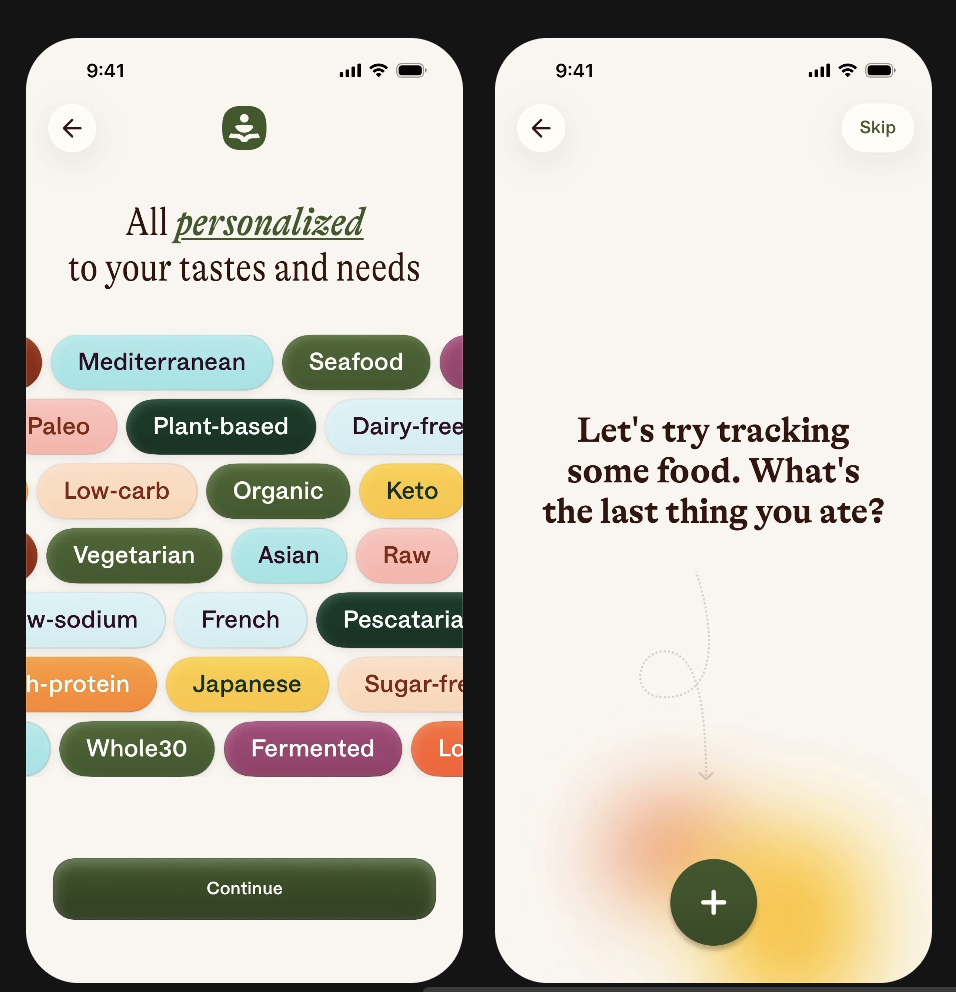

brody what do I want more from the app at this stage:

- minor optimizations to be done
- a better UI for the Friends tab, something that is pretty to look at, is informant, etc etc

about onboarding, how do I want it to be? (brb after checking mobbin for like 10 mins)

- show a problem screen (like this many people suffer from dementia etc, etc. and then
- - do i even need this shey?
  - na ra ra, what you want to say instead is resonate and re-iterate their painpoints?
  - - sum like "do you also hesitate to have conversation with loved ones", "would you want to improve your relationship with your loved ones" -> READ ARTICLES AND MATERIAL ON THIS TYPA DEMENTIA TO UNDERSTAND AND EMPATHIZE W EM MORE LIKE THAT
    - and then guide them through "How Remi Does It", where it is solving the problems mentioned above
- a complete guided tour of the app, one by one
- - like show only one element at a time, and tell the user what exactly happens when you click on each
  - and obviously have a skip button on the top right, that's just common mannerisms
  - make sure to have dots of how many screens there are and the current screen
  - make sure the UI is as animated and interactive as possible. For reference, look at Alma's complete onboarding process: [Alma Onboarding](https://mobbin.com/flows/6e3d85dd-e2ea-4747-93a7-1104b0e06c9e?utm_source=copy_link&utm_medium=link&utm_campaign=flow_sharing)

Spending some more time on mobbin to look at inspiration:
